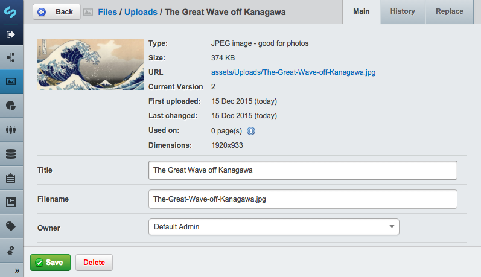
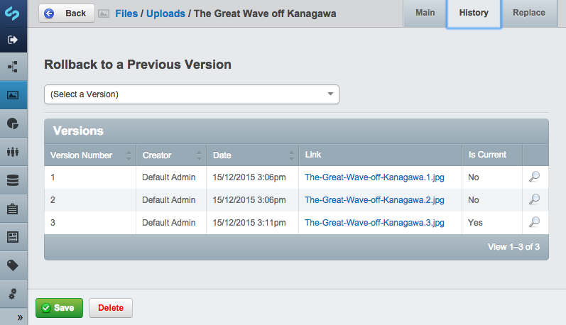

# Replacing images and files in the CMS

## Before we begin

Make sure that your SilverStripe CMS installation has the [Versioned Files](https://addons.silverstripe.org/add-ons/symbiote/silverstripe-versionedfiles/) module installed.

## Usage

When you view a file in the Files & Images section of the CMS, you will notice
that two tabs have been added - "History" and "Replace".

You can replace the file with an upload from your computer in the replace
tab. The replacement file must have the same file extension as the original.

The History tab contains a listing of all versions of the file, complete with
links. Once you have created more than one version of a file, you have the option to
rollback to a specific version in the Replace tab.

